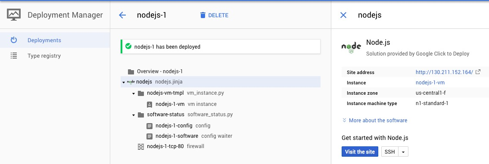

# Cloud Launcher

Good for getting started quickly with predefined configurations.

## Launching a node virtual machine

1. Visit https://console.cloud.google.com/launcher/browse
2. Enter 'node' in search
3. Select the 'Node.js application runtime' option
4. Click 'Launc On Compute Engine'
5. Select regions, zones, VM specs etc.
6. Select 'Allow HTTP traffic'
7. Click 'Deploy'

Deployment manager then shows the instance starting up.

Once launched one can visit the site, or SSH in.

## Compute Engine

Under [Compute Engine](https://console.cloud.google.com/compute/instances) we can view running instances.

Selecting an instance allows one to SSH in, view logs, mangae settings, and view API access that the instance has.

## Deleting the Instance

Under [Deployment Manager](https://console.cloud.google.com/dm/deployments) we can view all deployed compute instances. From here we can delete the node instance we spun up with Cloud Launcher. Once deleted, all resources are no longer available.

Deployment manager will show that there are no longer any deployments, and Compute Engine will indicate no running instances.
