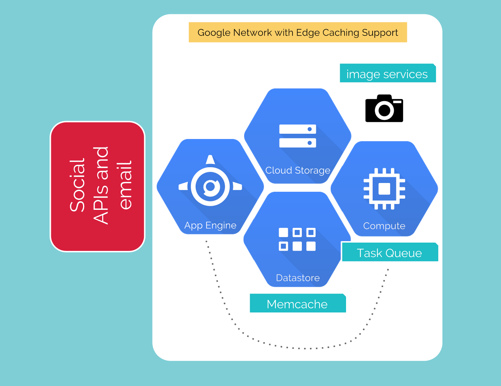

# 3. Example uses of Google Cloud Platform

## Khan Academy

Khan Academy use Google App Engine:

- no need for a sys-admin or anyone to manage deployment
- more time to focus on app development
- deploy at least once a day, up to 10 times a day

## Coca-Cola Happiness Flag

[happinessflag.com](http://www2.happinessflag.com/)

[Google Cloud guest post](https://medium.com/google-cloud/ci-t-uses-google-cloud-platform-to-power-the-coca-cola-happiness-flag-unveiled-on-the-pitch-at-3337f11392cc)

- world's largest mosaic flag croowdsourced from 200+ countries
- hybrid solution built on:
    - Google App Engine
    - Cloud Storage
    - Datastore
    - Compute Engine
- handled millions of images from Twitter, Facebook, Instagram, and email
- features:
    - redundancy
    - failover
    - backup
    - monitoring
    
## Backflip Studios - Mobile Games

[Google Cloud guest post](https://cloudplatform.googleblog.com/2014/04/backflip-studios-scales-mobile-games-with-google-cloud-platform.html)

- mobile game dev studio
- use Google App Engine and Datastore for game data
- auto scaling for handling volatile traffic
- use Cloud Storage and BigQuery for marketing teams to analyse app data
