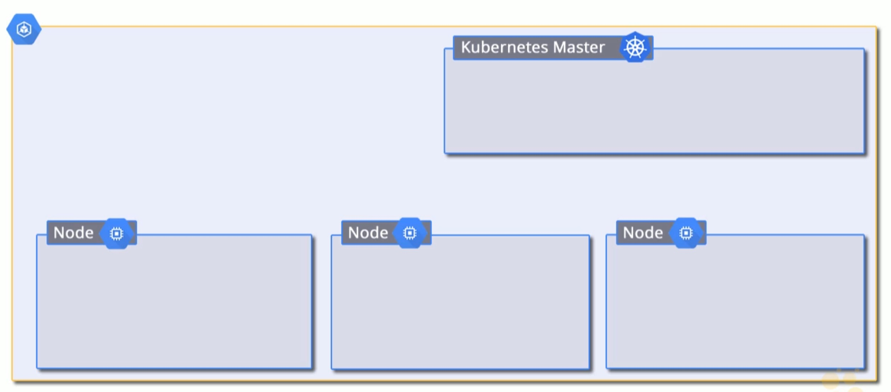
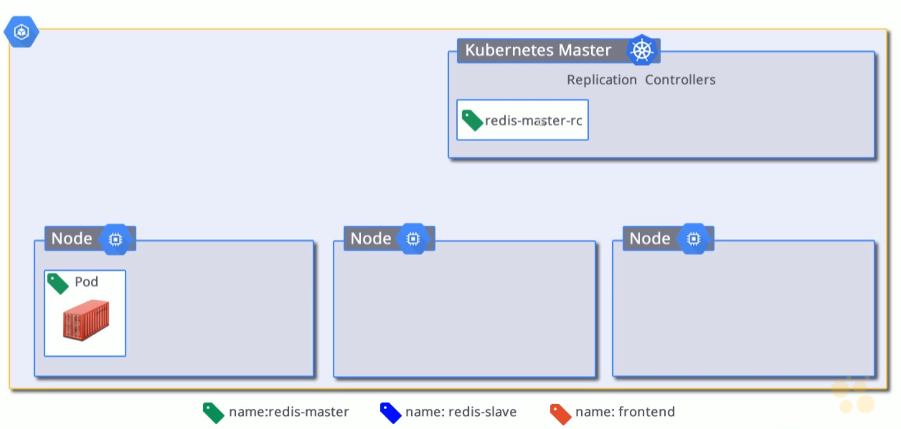
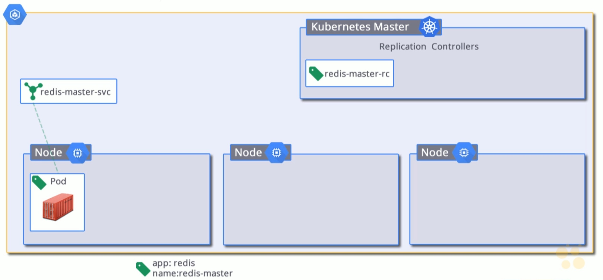
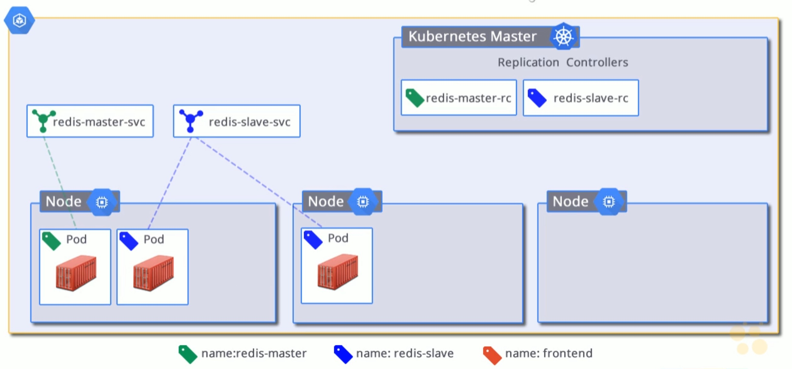

# 11. Google Container Engine

- containers give developers power over their environments - no longer have to worry about the host the application is running on.
- containers bring development and operations together
- without containers applications are generally deployed as monoliths
    - with containers we can separate applications into their own services, with their own teams, and own deployments
    
## Kubernetes

- open-source platform for orchestrating containers across clusters of machines
    - containers are great on their own, but orchestration is what allows one to:
        - schedule containers onto nodes
        - scale up/down
        - roll out udpates
        - balance containers across machines
- based on 10+ years of experience at Google
    - simplfies the following:
        - deployment
        - scaling
        - rolling out new features
        - load-balancing
- lean
    - lightweight
    - simple
    - accessible
- portable
    - public
    - private
    - hybrid
    - multi-cloud
- extensible
    - modular
    - pluggable
    - composable
- self-healing
    - auto-placement
    - auto-replication

## Google Container Engine (GKE)

[Container Engine](https://cloud.google.com/kubernetes-engine/)

- based on Kubernetes
    - containers as a service
        - Google Compute Engine
        - Docker
        - Kubernetes
- orchestrate and schedule docker containers
- consumes Compute Engine instances and resources
- uses a declarative syntax (using yml) to manage applications
- decouple operational and development concerns
- manages and maintains
    - logging
    - health management
    - monitoring
    - scaling

## Container Engine Resources

- container cluster
    - a group of GCE instances running Kubernetes
    - a cluster represents compute networking and storage
    - it's a combination of virtual machines, which are GCE instances running K8s, as well as services
- master node
    - hosts the REST API
    - hosts replication controllers
    - is fully managed, and can't be SSH into, but can be accessed via a web UI
    - if you were to setup up your own K8s cluster outside of GKE you would be responsible for managing master and all of its nodes
- nodes
    - machines where pods are scheduled
    - nodes act as K8s workers
    - host the Docker runtime
    - host a Kubelet agent which master uses to communicate with the nodes
- pods
    - a grouping of tightly coupled containers
    - pods are scheduled onto nodes
    - co-located group of containers that:
        - share context
        - share the same networking namespace 
        - expose an IP address
    - pods can be thought of as a logical host inside a node which is a physical host
    - pods are ephemeral
        - they can be destroyed / deleted at any time
        - one can dynamically spin up more pods when needed using a replication controller
- labels
    - these are user-defined values
    - key/value pairs attached to resources, e.g. pods
    - provide a way to organise pods
    - allow replication controllers and services a way to target pods through _selectors_
        - e.g. 
            - we can label frontend pods `fe`
            - we can label backend pods `be`
            - we can set up microservices with labels
            - replication controllers can be reference these labels for scaling pods up and down
            - if we need to route certain traffic to our frontends, we have a label to do that
- replication controllers
    - manage and monitor the lifecycle of pods
    - when configuring a replication controller we define the number of replicas (pods) across a cluster
    - replication controller will ensure that the specified number of pods is always there
    - handles scaling up / down
    - handles replacing pods that die
- services
    - provide stable IP address and DNS names for pods, because as pods are ephemeral, and are coming up and down, they are receiving new names
    - services make the ephemeral nature of pods discoverable
    - services define a set of pods, and a policy to access them
    - provide load-balancing services across the pods they target
    
## `kubectl`

- CLI utility that sends requests to the K8s cluster manager
    ```bash
    $ kubectl -h
    ```
- not installed with Cloud SDK. Must be [installed separately](https://kubernetes.io/docs/tasks/tools/install-kubectl/#install-kubectl)
- use `gcloud container` for managing clusters

    ```bash
    $ gcloud container clusters -h
    ```
    
    - create clusters
    - delete clusters
    - resize clusters (add / remove nodes)
    - get credentials
        - useful for when managing multiple clusters and we need to point `kubectl` to a particular cluster
        
## GKE Multi-tier Web App Example


We will build:

- a guestbook application
- with a frontend
- with 3 pods defined through replication controller so that we always have 3 frontends running via 3 nodes
- 1 redis master service where writes will go
    - running on 1 pod
    - best practise to always use a replication controller, even if there is only going to be 1 pod
- 1 redis slave service where reads will come into
    - running workers on 2 pods
    - when writes hit master, they will be replicated to our slave and thus workers
    
[Create a guestbook with Redis and PHP](https://cloud.google.com/kubernetes-engine/docs/tutorials/guestbook)

### Kubernetes Engine concepts

1. **deployment:** - a K8s resource that determines the configuration for a set of replicated pods
2. **services:** - create internal and external load balancers for a set of pods

### Create a K8s Engine cluster

1. 
    ```bash
    # create a cluster called guestbook that has 3 nodes
    $ gcloud container clusters create guestbook --num-nodes=3
    ```
2. once the cluster is built we can view information about the cluster:

    ```bash
    $ gcloud container clusters list
    $ gcloud container clusters describe guestbook
    ```
    
At this point we have the following configuration:



### Setup a Redis master

Data will be stored with Redis. The Redis master accepts writes, reads are done from slave instances.

We need to:

1. deploy a Redis master
2. create a service allowing the application to communicate with the Redis master to write data

#### Deploy a Redis master

We use `redis-master-deployment.yaml` to deploy the Redis master. A deployment is a configuration for a set of replicated pods.

```yaml
# redis-master-deployment.yaml
apiVersion: extensions/v1beta1
# this is a deployment
kind: Deployment
metadata:
  # call this pod 'redis-master'
  name: redis-master
spec:
  # create only 1 replica of this pod
  replicas: 1
  template:
    metadata:
      # services with selectors matching these labels will forward traffic here
      labels:
        app: redis
        role: master
        tier: backend
    spec:
      containers:
      - name: master
        image: k8s.gcr.io/redis:e2e  # or just image: redis
        resources:
          requests:
            cpu: 100m
            memory: 100Mi
        ports:
        - containerPort: 6379
```

We will have only one pod running an instance of the Redis master.

To deploy the pod using the above configuration:

```bash
# create a resource using the configuration found in file (-f) redis-master-deployment.yaml
$ kubectl create -f redis-master-deployment.yaml
```

We can see the results of the deployment by running `kubectl get pods`:

```bash
$ kubectl get pods
NAME                            READY     STATUS    RESTARTS   AGE
redis-master-7bd4d6ccfd-rh768   1/1       Running   0          1m

# or get additional information by running the command with the 'wide' output (-o)
# Output formats available are json|yaml|wide|custom-columns
$ kubectl get pods -o wide
NAME                            READY     STATUS    RESTARTS   AGE       IP          NODE
redis-master-7bd4d6ccfd-rh768   1/1       Running   0          1m        10.12.0.6   gke-guestbook-default-pool-dbb664fc-qj22
```

To see logs from a specific pod:

```bash
# kubectl logs -f POD_NAME
# get the logs for our new Redis master pod, specifying `follow=false`, which means logs are not streamed
$ kubectl logs -f redis-master-7bd4d6ccfd-rh768
```

We now have the following running on our cluster:



#### Create redis-master service

Without a service, our application won't be able to communicate with the pod running our Redis master. We'll create a service which proxies traffic to our Redis master pod.

```yaml
# redis-master-service.yaml
apiVersion: v1
# this is a service
kind: Service
metadata:
  # with a name of redis-master...?
  name: redis-master
  labels:
    app: redis
    role: master
    tier: backend
spec:
  # route traffic on 6379 to the target port of 6379 of the containers that match the specified selector labels below
  ports:
  - port: 6379
    targetPort: 6379
  # These are label selectors.
  # They match the labels deployed for the Redis master pod(s)
  # This ensures traffic is routed to that pod (or more if replicas was set to more than 1)
  selector:
    app: redis
    role: master
    tier: backend
```

We start the Redis master's service as follows:

```bash
$ kubectl create -f redis-master-service.yaml
```

Once the service is up and running, we can verify it by running `kubectl get service`:

```bash
$ kubectl get service
NAME           TYPE        CLUSTER-IP      EXTERNAL-IP   PORT(S)    AGE
kubernetes     ClusterIP   10.15.240.1     <none>        443/TCP    26m
redis-master   ClusterIP   10.15.252.226   <none>        6379/TCP   40s
```

Our cluster now looks like this:



### Set up Redis workers

Our Redis master is a single pod. We can make Redis worker replicas to make it highly available.

#### Deploy Redis slaves

In the same way that the Redis master pod deployment is configured through a yaml file, so are the Redis workers:

```yaml
# redis-slave-deployment.yaml
apiVersion: extensions/v1beta1
kind: Deployment
metadata:
  name: redis-slave
spec:
  # Create 2 pods
  # If this deployment is created, and there are no pods, 2 will be spun up on the cluster
  # If at any point there are more than 2 pods with this configuration on the cluster,
  # pods will be killed until 2 are reached
  replicas: 2
  template:
    metadata:
      # services matching these labels in the selector config will forward traffic 
      # to pods created using this config
      labels:
        app: redis
        role: slave
        tier: backend
    spec:
      containers:
      - name: slave
        image: gcr.io/google_samples/gb-redisslave:v1
        resources:
          requests:
            cpu: 100m
            memory: 100Mi
        env:
        - name: GET_HOSTS_FROM
          value: dns
          # If your cluster config does not include a dns service, then to
          # instead access an environment variable to find the master
          # service's host, comment out the 'value: dns' line above, and
          # uncomment the line below:
          # value: env
        ports:
        - containerPort: 6379
```

To create the Redis worker deployment:

```bash
$ kubectl create -f redis-slave-deployment.yaml
```

We can verify that in addition to our Redis master pod we now have 2 additional Redis slave pods:

```bash
$ kubectl get pods
NAME                            READY     STATUS    RESTARTS   AGE
redis-master-7bd4d6ccfd-rh768   1/1       Running   0          22m
redis-slave-84845b8fd8-nz5bb    1/1       Running   0          43s
redis-slave-84845b8fd8-t5jw4    1/1       Running   0          43s
```

#### Deploy Redis slave service

Before data can be read from the Redis slaves, we need a service to route traffic to them. Services provide load balancing to sets of pods.

```yaml
apiVersion: v1
# this is a service
kind: Service
metadata:
  # with the name of redis-slave
  name: redis-slave
  labels:
    app: redis
    role: slave
    tier: backend
spec:
  ports:
  - port: 6379
  # route traffic to pods deployed with the following labels
  selector:
    app: redis
    role: slave
    tier: backend
```

As with the Redis master service, we run this service in a similar manner:

```bash
$ kubectl create -f redis-slave-service.yaml
```

And we can view the currently running services:

```bash
$ kubectl get service
NAME           TYPE        CLUSTER-IP      EXTERNAL-IP   PORT(S)    AGE
kubernetes     ClusterIP   10.15.240.1     <none>        443/TCP    38m
redis-master   ClusterIP   10.15.252.226   <none>        6379/TCP   13m
redis-slave    ClusterIP   10.15.241.254   <none>        6379/TCP   40s
```

Our cluster now looks as follows:



### Set up the web front-end

With storage up and running, we can now deploy the guestbook servers. As with the Redis workers we will deploy a replicated application using a deployment.

```yaml
# frontend-deployment.yaml
apiVersion: extensions/v1beta1
# this is a deployment
kind: Deployment
metadata:
  # named frontend
  name: frontend
spec:
  # running on 3 pods
  replicas: 3
  template:
    metadata:
      # A service matching the following selectors will route and load balance 
      # traffic to however many pods we have configured using this deployment
      labels:
        app: guestbook
        tier: frontend
    spec:
      containers:
      - name: php-redis
        image: gcr.io/google-samples/gb-frontend:v4
        resources:
          requests:
            cpu: 100m
            memory: 100Mi
        env:
        - name: GET_HOSTS_FROM
          value: dns
          # If your cluster config does not include a dns service, then to
          # instead access environment variables to find service host
          # info, comment out the 'value: dns' line above, and uncomment the
          # line below:
          # value: env
        ports:
        - containerPort: 80
```

We can create the deployment as with the Redis master and slave deployments:

```bash
$ kubectl create -f frontend-deployment.yaml
```

and verify that our 3 replicas are indeed running. 

```bash
# select pods to query by a list of labels that identify the frontend
$ kubectl get pods -l app=guestbook -l tier=frontend
```

#### Expose the frontend on an external IP address

The Redis master and slave services are available only within the container cluster. This is because the default type for a service is `ClusterIP`. `ClusterIP` creates a single IP address for all the pods the service points to, and is only accessible within the cluster.

The frontend needs to be exernally available - i.e. outside of the cluster. _Exposing an IP is a billable service_. To do this, a service needs to be specified with `type: LoadBalancer`. 

```yaml
# frontend-service.yaml
apiVersion: v1
kind: Service
metadata:
  name: frontend
  labels:
    app: guestbook
    tier: frontend
spec:
  # This line was uncommented to allow for the service to be 
  # available outside of the cluster
  # When the service is created, K8s Engine creates a load balancer
  # and external IP.
  type: LoadBalancer
  # Route traffic incoming on port 80 to port 80 inside the cluster.
  # targetPort is not explicitly defined, which results in requests
  # being routed to the same port that incoming traffic is configured
  # to, i.e. requests on 80 externally will be routed to 80 internally
  ports:
  - port: 80
  # route requests against this service to pods with the following labels
  selector:
    app: guestbook
    tier: frontend
```

Create the frontend service:

```bash
$ kubectl create -f frontend-service.yaml
```

We can see the newly running service as before:

```bash
$ kubectl get service
NAME           TYPE        CLUSTER-IP      EXTERNAL-IP   PORT(S)    AGE
frontend       ClusterIP   10.15.246.17    <pending>     80/TCP     1m
kubernetes     ClusterIP   10.15.240.1     <none>        443/TCP    1h
redis-master   ClusterIP   10.15.252.226   <none>        6379/TCP   36m
redis-slave    ClusterIP   10.15.241.254   <none>        6379/TCP   23m
```

Our cluster now looks like this:


### Visit the guestbook

Using `kubectl` we can get the external IP of the frontend service (once the IP is configured):

```bash
$ kubectl get service frontend 
NAME       TYPE           CLUSTER-IP     EXTERNAL-IP     PORT(S)        AGE
frontend   LoadBalancer   10.15.241.20   35.193.51.166   80:32323/TCP   1m
```

### Scaling up the web frontend

Should the frontend suddenly experience a lot of traffic and you need more servers we can scale our service up via `kubectl`:

```bash
# scale the frontend deployment to 5 replicas
$ kubectl scale deployment frontend --replicas=5
$ kubectl get pods
NAME                            READY     STATUS    RESTARTS   AGE
frontend-685d7ff496-4rxqk       1/1       Running   0          3s
frontend-685d7ff496-6p2vd       1/1       Running   0          28m
frontend-685d7ff496-6wh8r       1/1       Running   0          3s
frontend-685d7ff496-767g7       1/1       Running   0          28m
frontend-685d7ff496-pvkcb       1/1       Running   0          28m
redis-master-7bd4d6ccfd-rh768   1/1       Running   0          1h
redis-slave-84845b8fd8-nz5bb    1/1       Running   0          41m
redis-slave-84845b8fd8-t5jw4    1/1       Running   0          41m
```

Deployments can be scaled down in the same way.

### Cleanup

Make sure to clean up resources to avoid unnecessary billing:

#### Delete the service

Deallocate the Cloud load balancer for the frontend:

```bash
$ kubectl delete service frontend
```

This deletes the load balancer asynchronously.

#### Wait for the load balancer for the frontend service to be deleted

```bash
$ gcloud compute forwarding-rules list
```

#### Delete the container cluster

Delete the resources associated with the cluster; compute instances, disks, and network resources:

```bash
$ gcloud container clusters delete guestbook
```
