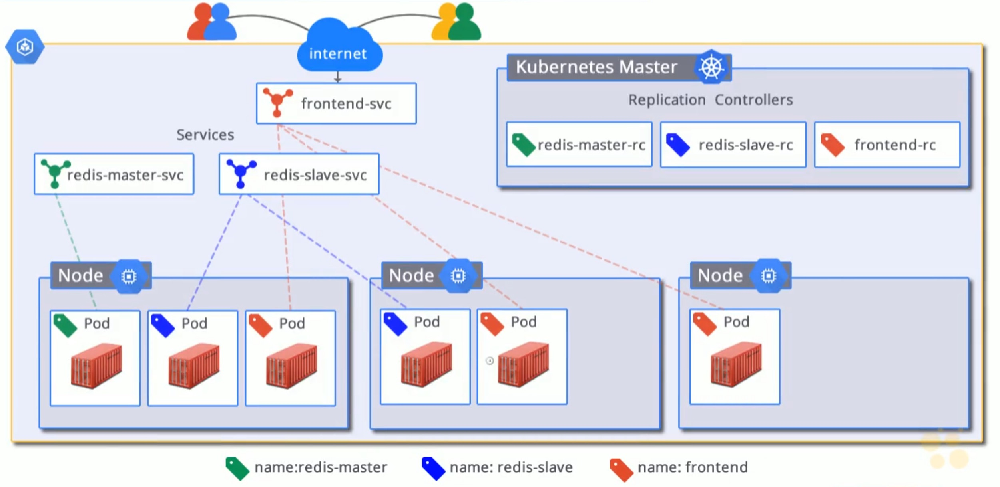

# 11. Google Container Engine

- containers give developers power over their environments - no longer have to worry about the host the application is running on.
- containers bring development and operations together
- without containers applications are generally deployed as monoliths
    - with containers we can separate applications into their own services, with their own teams, and own deployments
    
## Kubernetes

- open-source platform for orchestrating containers across clusters of machines
    - containers are great on their own, but orchestration is what allows one to:
        - schedule containers onto nodes
        - scale up/down
        - roll out udpates
        - balance containers across machines
- based on 10+ years of experience at Google
    - simplfies the following:
        - deployment
        - scaling
        - rolling out new features
        - load-balancing
- lean
    - lightweight
    - simple
    - accessible
- portable
    - public
    - private
    - hybrid
    - multi-cloud
- extensible
    - modular
    - pluggable
    - composable
- self-healing
    - auto-placement
    - auto-replication

## Google Container Engine (GKE)

[Container Engine](https://cloud.google.com/kubernetes-engine/)

- based on Kubernetes
    - containers as a service
        - Google Compute Engine
        - Docker
        - Kubernetes
- orchestrate and schedule docker containers
- consumes Compute Engine instances and resources
- uses a declarative syntax (using yml) to manage applications
- decouple operational and development concerns
- manages and maintains
    - logging
    - health management
    - monitoring
    - scaling

## Container Engine Resources

- container cluster
    - a group of GCE instances running Kubernetes
    - a cluster represents compute networking and storage
    - it's a combination of virtual machines, which are GCE instances running K8s, as well as services
- master node
    - hosts the REST API
    - hosts replication controllers
    - is fully managed, and can't be SSH into, but can be accessed via a web UI
    - if you were to setup up your own K8s cluster outside of GKE you would be responsible for managing master and all of its nodes
- nodes
    - machines where pods are scheduled
    - nodes act as K8s workers
    - host the Docker runtime
    - host a Kubelet agent which master uses to communicate with the nodes
- pods
    - a grouping of tightly coupled containers
    - pods are scheduled onto nodes
    - co-located group of containers that:
        - share context
        - share the same networking namespace 
        - expose an IP address
    - pods can be thought of as a logical host inside a node which is a physical host
    - pods are ephemeral
        - they can be destroyed / deleted at any time
        - one can dynamically spin up more pods when needed using a replication controller
- labels
    - these are user-defined values
    - key/value pairs attached to resources, e.g. pods
    - provide a way to organise pods
    - allow replication controllers and services a way to target pods through _selectors_
        - e.g. 
            - we can label frontend pods `fe`
            - we can label backend pods `be`
            - we can set up microservices with labels
            - replication controllers can be reference these labels for scaling pods up and down
            - if we need to route certain traffic to our frontends, we have a label to do that
- replication controllers
    - manage and monitor the lifecycle of pods
    - when configuring a replication controller we define the number of replicas (pods) across a cluster
    - replication controller will ensure that the specified number of pods is always there
    - handles scaling up / down
    - handles replacing pods that die
- services
    - provide stable IP address and DNS names for pods, because as pods are ephemeral, and are coming up and down, they are receiving new names
    - services make the ephemeral nature of pods discoverable
    - services define a set of pods, and a policy to access them
    - provide load-balancing services across the pods they target
    
## `kubectl`

- CLI utility that sends requests to the K8s cluster manager
    ```bash
    $ kubectl -h
    ```
- not installed with Cloud SDK. Must be [installed separately](https://kubernetes.io/docs/tasks/tools/install-kubectl/#install-kubectl)
- use `gcloud container` for managing clusters

    ```bash
    $ gcloud container clusters -h
    ```
    
    - create clusters
    - delete clusters
    - resize clusters (add / remove nodes)
    - get credentials
        - useful for when managing multiple clusters and we need to point `kubectl` to a particular cluster
        
## GKE Multi-tier Web App Example



We will build:

- a guestbook application
- with a frontend
- with 3 pods defined through replication controller so that we always have 3 frontends running via 3 nodes
- 1 redis master service where writes will go
    - running on 1 pod
    - best practise to always use a replication controller, even if there is only going to be 1 pod
- 1 redis slave service where reads will come into
    - running workers on 2 pods
    - when writes hit master, they will be replicated to our slave and thus workers
    
[Create a guestbook with Redis and PHP](https://cloud.google.com/kubernetes-engine/docs/tutorials/guestbook)
