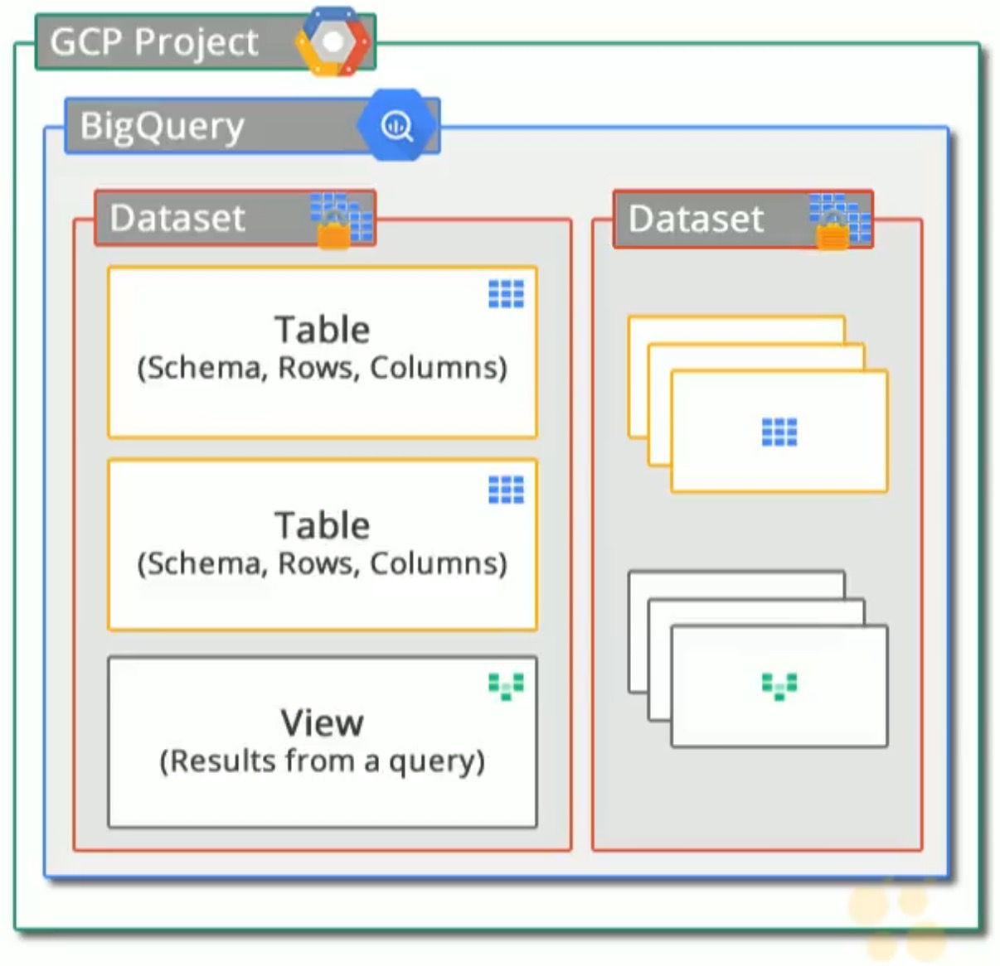

# 20. Google BigQuery

Big data analysis usually requires big data infrastructure; a highly skilled team of operations and development staff to manage the different aspects of big data analysis.

Google BigQuery solves this by providing:

- a fully managed
- no ops
- low cost 

analytics database. Google takes care of infrastructure, and provides a SQL-like manner of interacting with data.

## Google BigQuery

[Google BigQuery](https://cloud.google.com/bigquery)

- provides a service for near real-time interactive analysis of big data sets
    - TB to PB
- based on columnar structure for high performance
- query using SQL-like syntax
- only pay for storage and processing
- zero administration for performance and scale
- secure, reliable, and supports open standards

## BigQuery Resources

- projects can host one or more datasets
- access to data is typically controlled using access control lists (ACLs) on a dataset
- tables contain data in BigQuery
- used to define a schema for the data
- BigQuery also supports views (virtual tables) defined by a SQL query

CBTNuggets BigQuery project diagram: 



## Sample query

BigQuery has a number of reay-made public data sample tables useful for experimenting when getting started. `natality` is one of those sample tables.

```sql
SELECT
  weight_pounds, state, year, gestation_weeks
FROM
  publicdata:samples.natality
--    [1]      [2]     [3]
-- [1] - project
-- [2] - dataset
-- [3] - table
ORDER BY
  weight_pounds ASC
LIMIT 10;
```

## Accessing BigQuery

BigQuery can be accessed in a number of ways:

- Web UI at [bigquery.cloud.google.com](https://bigquery.cloud.google.com/)
- Cloud SDK using the `bq` utility:
    - `bq query ...`
    - interactively via `shell` command
- RESTful JSON API via client libraries
- using a variety of 3rd-party tools
- Apps scripts

## Exploring BigQuery

Visit [BigQuery](https://bigquery.cloud.google.com/)

The sidebar has:

- project switcher
- public data sets

We can see details for the [natality dataset](https://bigquery.cloud.google.com/table/bigquery-public-data:samples.natality?tab=details).

### Querying a dataset

On the natality dataset:

1. select 'Query Table'
2. paste the following query, or write your own, into the textarea:

    ```sql
    SELECT
      weight_pounds, state, year, gestation_weeks
    FROM
      publicdata:samples.natality
    ORDER BY
      weight_pounds ASC
    LIMIT 10;
    ```
3. the green tick on the right is a validator, indicating how much data will be processed by the query
    - important when evaluating what you'll pay when processing data
